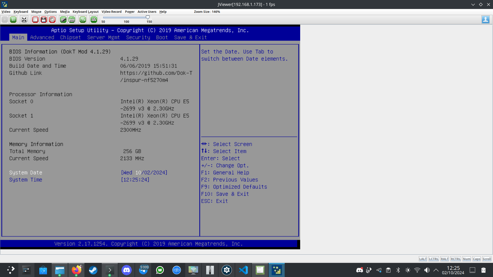

# Inspur NF5270M4 BIOS Mod

## Description

This project provides a modified BIOS for the **Inspur NF5270M4** server motherboard. The goal is to unlock advanced features, enable overclocking, and allow the motherboard to function without official Inspur equipment (such as dual PSU units or proprietary chassis). The project includes modified BIOS files, original firmware, tools, and detailed documentation.

## Key Features

- Unlocked BIOS menus for advanced hardware control.
- Overclocking options enabled (use cautiously).
- Turbo Boost unlocked for V3 CPUs. (Only -2 BIOSes)
- Support for advanced storage and power management systems.
- Reduced restrictions imposed by Inspur’s proprietary equipment (guide to flash correct BMC web firmware).
- **Fix for BMC Self-Test failure** during startup, drastically reducing boot time by disabling the BMC by default and some tweaks in bios (see changelogs.txt).
- **UEFI boot mode enabled by default**: Fixes issues with JViewer's display output and allows full remote control via iKVM (JViewer) by disabling CSM (Compatibility Support Module).
- Workaround for FRU / DMI Data not being properly set. Please go to Server Mgmt -> FRU Information -> SAVE FRU INFORMATION and set manualy informations like Serial number, Asset Tag, Board revision etc. Please powercycle the board to make it effective.

**NOTE**: If you are not using official Inspur equipment, it's recommended to use the provided **BMC Firmware version 4.3.0** from NP5570M4. You can always revert back to the required firmware for your specific Inspur chassis if needed.

## Warnings

- **DMI Data**: Flashing the BIOS may overwrite DMI data. Please use AMI software to restore SMBIOS data. An example `smbios.txt` is provided to help fill in this information.
  
- **Important for BIOS 4.1.29-2**:
  - **Do not flash this BIOS** if you do not have an adequate cooling system and have not repasted the VRMs heatsink and CPU.
  - This BIOS **will not post** if an **E5-2600 V4** series CPU is installed.
  - Even though overclocking options are enabled, I cannot be held responsible for any damage, instability, or loss resulting from its use.

## BIOS Versions

### 4.1.27 (09/29/2024)
- Initial release.
- Updated strings and unlocked menus.
- Overclocking features enabled.
- AES-NI enabled by default.
- Hot-plug support for PCH SATA and sSATA enabled.

### 4.1.28 (10/01/2024)
- Intel microcode updated.
- FRB-2 timer disabled.
- More power and RAM management options unlocked.

### 4.1.29 (10/02/2024)
- **UEFI-only boot** enabled by default (fixes JViewer display issue).
- **BMC disabled by default**, fixing the "BMC Self-Test failed" issue and speeding up boot time.
- Intel ME debug options unlocked.

### 4.1.29-2 (Turbo Boost Unlock)
- Based on BIOS 4.1.29.
- **Turbo Boost unlocked** for V3 CPUs.
- Multiple versions available: `xxx-xx-xx` represents the undervolting applied to Vcore/Memory Controller/Cache in millivolts.

## Flashing Instructions

1. Download the desired BIOS file from the appropriate release folder.
2. Follow the corresponding flashing guide for your OS, available in the **Documentation** folder (guides for Linux, DOS, and Windows).
3. Ensure you understand the risks of flashing a modified BIOS before proceeding.

## Documentation

This project includes various documents to assist with installation, configuration, and BIOS management:
- **Flashing Guides**: Detailed instructions for Linux, DOS, and Windows.
- **Jumper Configuration**: Information on jumper settings for the motherboard.
- **User Manuals**: Translated user guides for the NF5270M4 motherboard (available in English, French, Chinese, and Russian).
- **Technical Documentation**: Datasheets, certifications, and other technical documents related to the motherboard.

## Contributions

Contributions are welcome! If you have suggestions, corrections, or have tested the BIOS, feel free to submit a pull request or contact me directly.

## Donations

If this project helped you, feel free to support me by donating:

- **BTC**: `3Qy6PFGskaJhd2gbGSNQiGJ3doB51Fvg7S`

Thank you for your support!

---

**Disclaimer**: This modified BIOS is provided "as is," and the author takes no responsibility for any damage, instability, or loss that results from its use.

# Mod BIOS Inspur NF5270M4

## Description

Ce projet fournit une version modifiée du BIOS pour la carte mère **Inspur NF5270M4**. L'objectif est de débloquer des fonctionnalités avancées, d'activer l'overclocking, et de permettre à la carte mère de fonctionner sans l'équipement officiel d'Inspur (comme les blocs d'alimentation doubles ou le châssis propriétaire). Le projet inclut des fichiers BIOS modifiés, des firmwares originaux, des outils et une documentation détaillée.

## Caractéristiques principales

- Menus du BIOS débloqués pour un contrôle avancé du matériel.
- Options d'overclocking activées (à utiliser avec précaution).
- Turbo Boost débloqué pour les processeurs V3.
- Prise en charge des systèmes de gestion de stockage et d'alimentation avancés.
- Réduction des restrictions imposées par l'équipement propriétaire d'Inspur.
- **Correction du problème "BMC Self-Test failed"** au démarrage, réduisant considérablement le temps de démarrage en désactivant par défaut le BMC.
- **Mode UEFI activé par défaut** : Corrige les problèmes d'affichage JViewer et permet un contrôle à distance complet via iKVM (JViewer) en désactivant le mode CSM (Compatibility Support Module).
- - Solution pour les données FRU / DMI qui ne sont pas correctement définies. Veuillez aller dans **Gestion du Serveur** -> **Informations FRU** -> **ENREGISTRER LES INFORMATIONS FRU**, et renseigner manuellement les informations comme le numéro de série, la balise d'actif, la révision de la carte, etc. Veuillez redémarrer complètement la carte mère pour que cela prenne effet.

**REMARQUE** : Si vous n'utilisez pas l'équipement officiel d'Inspur, il est recommandé d'utiliser le **firmware BMC version 4.3.0** fourni depuis le NP5570M4. Vous pouvez toujours revenir à un firmware adapté à votre châssis d'origine si nécessaire.

## Avertissements

- **Données DMI** : Le flashage du BIOS peut écraser les données DMI. Utilisez un logiciel AMI pour restaurer les données SMBIOS. Un exemple `smbios.txt` est fourni pour vous aider à remplir ces informations.
  
- **Important pour le BIOS 4.1.29-2** :
  - **Ne flashez pas ce BIOS** si vous n'avez pas un système de refroidissement adéquat et si vous n'avez pas remplacé la pâte thermique sur les VRM et le CPU.
  - Ce BIOS **ne fonctionnera pas** avec un processeur **E5-2600 V4**.
  - Même si les options d'overclocking sont activées, je ne peux être tenu responsable des dommages, instabilités ou pertes survenus.

## Versions du BIOS

### 4.1.27 (29/09/2024)
- Version initiale.
- Mises à jour des chaînes de caractères et menus débloqués.
- Fonctionnalités d'overclocking activées.
- AES-NI activé par défaut.
- Prise en charge du hot-plug SATA et sSATA activée.

### 4.1.28 (01/10/2024)
- Mise à jour du microcode Intel.
- Timer FRB-2 désactivé.
- Options avancées de gestion d'alimentation et RAM débloquées.

### 4.1.29 (02/10/2024)
- **Démarrage uniquement UEFI** activé par défaut (corrige le problème d'affichage de JViewer).
- **BMC désactivé par défaut**, corrigeant le problème "BMC Self-Test failed" et accélérant le démarrage.
- Options de débogage Intel ME débloquées.

### 4.1.29-2 (Turbo Boost Unlock)
- Basé sur le BIOS 4.1.29.
- **Turbo Boost débloqué** pour les processeurs V3.
- Plusieurs versions disponibles : `xxx-xx-xx` représente l'undervolting appliqué à Vcore/Contrôleur mémoire/Cache en millivolts.

## Instructions de Flash

1. Téléchargez le fichier BIOS souhaité depuis le répertoire correspondant.
2. Suivez le guide de flashage correspondant à votre système d'exploitation dans le dossier **Documentation** (guides disponibles pour Linux, DOS et Windows).
3. Assurez-vous de bien comprendre les risques liés au flashage d'un BIOS modifié avant de procéder.

## Documentation

Le projet inclut plusieurs documents pour vous assister dans l'installation, la configuration et la gestion du BIOS :
- **Guides de Flashage** : Instructions détaillées pour Linux, DOS et Windows.
- **Configuration des Jumpers** : Informations sur les réglages des jumpers pour la carte mère.
- **Manuels d'Utilisateur** : Guides traduits pour la carte mère NF5270M4 (disponibles en français, anglais, chinois, et russe).
- **Documentation Technique** : Fiches techniques, certifications, et autres documents techniques liés à la carte mère.

## Contributions

Les contributions sont les bienvenues ! Si vous avez des suggestions, des corrections ou si vous avez testé le BIOS, n’hésitez pas à soumettre une **pull request** ou à me contacter directement.

## Donations

Si ce projet vous a été utile, n'hésitez pas à me soutenir en faisant un don :

- **BTC** :
